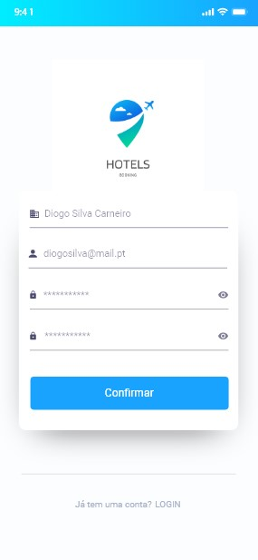
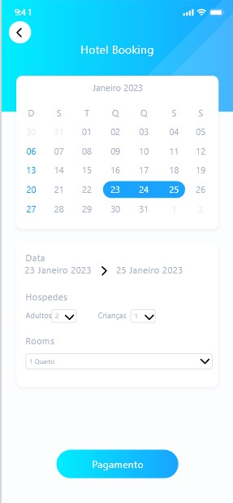

# Caderno-Digital-Diogo-Carneiro-DIM
Caderno digital para apresentação de conteudos da disciplina Desenvolvimento de Interfaces Multimédia
_____
# Affordances
+ O que são: 
Affordance é o potencial de um objeto de ser usado como foi projetado para ser usado.
O exemplo mais clássico de Affordance é uma porta com maçaneta. Quando olhamos para essa porta, a única interação que parece possível é a de mexer na maçaneta. Essa pode não ser a única ação possível, mas é sua Affordance mais forte.
Quem projeta interfaces trabalha diretamente com as Affordances, até mesmo se não souber do que se trata. Diferente de objetos físicos, que têm Affordances baseadas no seu tamanho, formato e peso, as interfaces na web e mobile têm que ganhar as suas Affordances pelas representações gráficas e metáforas.
### Tipos de Affordance
1. Explícita 
É sinalizada por algum tipo de linguagem verbal. Textos como “clique aqui” explicitam e traduzem a Affordance da ação de clique. São explícitas porque todo usuário, sem qualquer experiência em interfaces, pode adivinhar como interagir com o objeto.

|  | 
|:--:| 
| *Exemplo de Affordance explicito* |

2. Convencional 
É o tipo mais comum de Affordance nas interfaces. Nós sabemos, por exemplo, que as palavras sublinhadas e em azul num texto são links clicáveis. Sabemos que o logo no topo de uma página pode ser clicado e nos leva à página inicial do site.

|  | 
|:--:| 
| *Exemplo de Affordance Convencional* |

3. Oculta 
Uma Affordance oculta fica aparente só quando uma certa condição é completada. Por exemplo: palavras que viram links clicáveis só quando se passa o cursor sobre elas.
Outro exemplo perfeito são os cards do Pinterest, com cinco Affordances reveladas quando passamos o cursor por cima. (1) Clique no botão Salvar, (2) clique no botão “Compartilhar”, (3) clique no botão “Like“, (4) clique para dar zoom e (5) clique no botão “Mais”.

|  | 
|:--:| 
| *Exemplo de Affordance Oculta* |

4. Metafórica 
Desde as primeiras interfaces gráficas, sempre usamos referências do mundo real como metáforas em interfaces digitais. Ícones e símbolos são um grande exemplo disso: o carrinho de compra, o envelope, o telefone, o vídeo, a câmera, a impressora, etc.

|  | 
|:--:| 
| *Exemplo de Affordance Metafórica* |

# Signifiers
+ O que são: 
Signifiers são pistas perceptíveis que os designers incluem em (por exemplo) interfaces para que os usuários possam descobrir facilmente o que fazer. Os designers usam marcas, sons e outros sinais para ajudar as pessoas a realizar as tarefas apropriadas.

|  | 
|:--:| 
| *Exemplo de Signifiers* |
| *Colocamos uma placa de “puxe” ou “empurre”, que é o Signifier que guia o usuário ao objetivo.* |

|  | 
|:--:| 
| *Exemplo de Signifiers* |
| *Cor verde e vermelha facilita o entendimento do utilizador as opções.* |

# Feedback
+ O que é: 
O feedback da interface do utilizador refere-se a como a interface do produto foi projetada para responder e o tipo de output que ela gera com base na forma como os utilizadores interagem com ela.

|  | 
|:--:| 
| *Exemplo de Feedback* |
| *Barra de progresso dão um feedback ao utilizador de que algo está a acontecer.* |

# Utilizadores primários, secundários, e terciários
+ Utilizadores Primários 
O utilizador primário nada mais é que nosso "público-alvo", onde deveremos olhar para entrar no mercado. São o grupo de utilizadores que utilizarão o produto e/ou solução que estamos a criar.

+ Utilizadores Secundário 
Somos nós toda a equipa envolvida no projeto/solução de forma direta ou indireta desenvolvedores. Todos que estão envolvidos de dentro de uma visão alta do projeto, são considerados usuários secundários.

+ Utilizadores Terciários 
São aqueles que não planeámos, não fizemos testes de conteúdo e que não estávamos à espera que utilizassem a nossa app.
# Mockups entregues para avaliação
As imagens foram produzidas para um estudo feito para fazer o design que irei apresentar mais á frente para a aplicação.
|   |   |   |   |
|---|---|---|---|
| *Mockup check-in*  | *Mockup confirmação check-in*  | *Mockup check-out* | *Mockup confirmação check-out*  |

|   |   |   |   |
|---|---|---|---|
| *Mockup Pagina inicial* | *Mockup Login*  | *Mockup Serviço ginasio*  | *Mockup Serviço Spa*  |

|   | 
|---|
| *Mockup Serviço restaurante* |

# Entrega final prototipos de alto nivel
As imagens a seguir apresentadas foram feitas através da ferramenta adobe xd sendo a proposta final de design para a aplicação.
|   |   |   |   |
|---|---|---|---|
| *Pagina Login* | *Pagina sign_up*  | *Pagina sign_in apos criar conta*  | *Pagina Listagem de hoteis*  |
+ A aplicação inicia na pagina Login caso o utilizador não tenha conta poderá fazer o registo e então depois fazer o login.
+ Após iniciar sessão na aplicação o utilizar irá então chegar á listagem dos hoteis disponíveis para fazer a reserva.

|   |   |   |   |
|---|---|---|---|
| *Pagina detalhes do hotel* | *Pagina booking do hotel*  |  *Pagina Pagamento da reserva*  | *Pagina confirmação de pagamento*  |
+ Após escolher o hotel em que pretende fazer a reserva irá então ser direcionado para os detalhes do hotel e onde poderá fazer então a reserva do hotel.
+ Caso o utilizar queira então fazer a reserva e clique no botão fazer reserva irá então ser redirecionado para a pagina de booking do hotel e escolher os dias em que irá então ficar no hotel quantos hospedes são e quantos quartos pretende reservar.
+ Após isso terá de colocar os dados do cartão mulitibanco para proceder então ao pagamento da reserva seguindo então para a pagina de confirmação da reserva.

|   |   |   |   |
|---|---|---|---|
| *Pagina check-in hotel* | *Pagina menu hotel*  | *Pagina marcação ginasio*  | *Pagina marcação Piscina*  |
+ Após então ver a sua reserva confirmada o utilizador terá então de fazer o check-in e então ai sim terá acesso ao menu do hotel onde poderá ir para a marcação no ginasio e na piscina ou pedir o serviço de quartos.
+ Ao clicar num dos botões será redirecionado para uma das pagina onde poderá então marcar o dia e hora que pretende desfrutrar do serviço.

|   |   |   |   |
|---|---|---|---|
| *Menu do bar do hotel* | *Pagina reservas atuais* | *Pagina confirmação marcação ginásio*  | *Pagina confirmação marcação piscina*  |
+ Ao clicar no menu anterior será redirecionado para a pagina do menu do bar onde poderá escolher qual o pedido que pretende pedir.
+ Quando clica no menu hamburguer será redirecionado para a página das reservas.
+ As duas ultimas paginas são a confirmação das marcações de ginásio e da piscina anteriores.

|   |   |   |   |
|---|---|---|---|
| *Pagina Pedido de serviço de quarto* | *Pagina detalhe das reservas*  | *Pagina check-out*  | *Pagina check-out escolha dia*   |
+ Ao clicar no botão de adicionar ao pedido na pagina do menu do bar do hotel será então redirecionado para a pagina onde terá o pedido inteiro e poderá então finalizar o pedido.
+ Na pagina reservas caso clique na reserva que tem atualmente será então rederecionado para a página onde poderá ver as informações sobre a reserva e efetuar o check-out.
+ Ao clicar no botão check-out poderá então efetuar o check-out do hotel, sendo então redirecionado para a pagina inicial da aplicação. 

|  | 
|:--:| 
| *Pagina confirmação pedido de serviço de quartos* |
+ Esta página será a confirmação do pedido de serviço de quartos.
